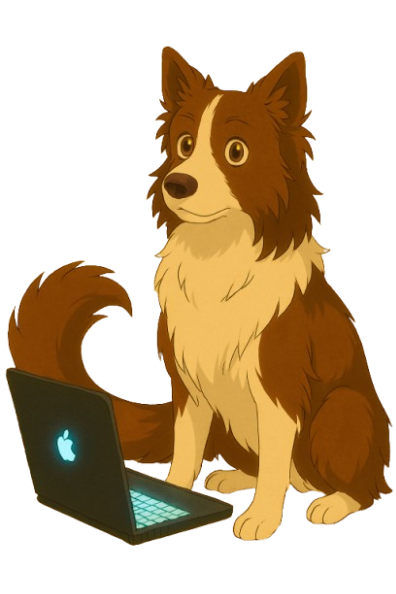

 
[!+:%29)](https://git.io/typing-svg)

&nbsp;

    

        
    

    

        
    

&nbsp;

  
    
   
  
  
  
    
  
    
  

  
  
  
  
     
    
    
  
  
    

&nbsp;

   
<h1>Informações para contato:</h1>
<a href="https://www.linkedin.com/in/ezpmartins/">

   
<h3> Sobre mim </h3>

🎓 Estou no último semestre do curso de Análise e Desenvolvimento de Sistemas na SPTech e estou sempre em busca de novos aprendizados para me manter atualizado no mundo da tecnologia.

💻 Atualmente, sou estagiário na área de Segurança da Informação, focado em Arquitetura e Redes (Blue Team) na SEK. No entanto, meu objetivo é migrar para a área de desenvolvimento no futuro, unindo minha paixão por resolver problemas com a criatividade que encontrei na programação. Desde pequeno, gostava de inventar coisas, e foi no código que descobri um universo para criar soluções inovadoras.

🐾 Além de tecnologia, sou uma pessoa que adora animais! Eles sempre fizeram parte da minha vida e são uma fonte de inspiração para mim, lembrando da importância de cuidar e inovar pensando no bem-estar de todos.

🎯 Gosto de desafios, inovação e de trocar ideias. Meu objetivo é combinar conhecimentos em arquitetura de sistemas, redes e desenvolvimento para criar soluções tecnológicas de alto impacto.

